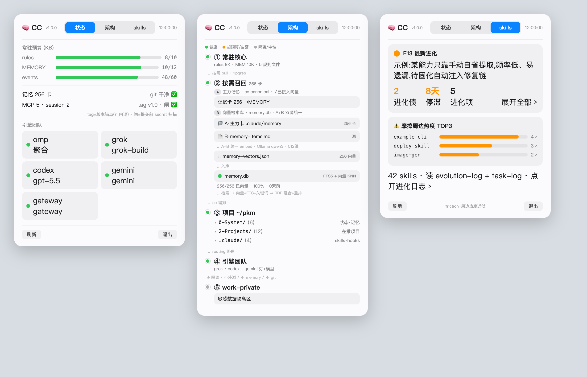

# cc-monitor

> A macOS menu-bar status monitor for [Claude Code](https://docs.claude.com/claude-code) —
> see your resident-context budget, memory, git, engines, and skill health at a glance.
>
> 一个 macOS 菜单栏状态监视器，实时显示 Claude Code 的常驻上下文预算 / 记忆 / git / 引擎团队 / skill 健康度。

**English** · [简体中文](README.zh-CN.md)



<sub>↑ Faithful UI mockup with fully anonymized sample data — status / architecture / skills tabs.</sub>

## What it shows

A native menu-bar icon (gauge when healthy, ⚠️ when over budget). Click to open a 3-tab panel:

- **Status** — resident-context budget bars (rules / MEMORY / events, green = healthy, orange = over soft-limit), memory card count, MCP & session count, git dirty/tag, engine team lights.
- **Architecture** — a "subway-line" view of the cognitive architecture (resident core → on-demand recall → project zone → engine team → privacy vault), every node clickable to reveal the real path in Finder. The recall layer shows the memory→embedding→sqlite vector-retrieval chain with live health.
- **Skills** — skill self-evolution status (latest insight, evolution debt, stale days, friction-heat top-3), with reversible acknowledge.

Live updates via **FSEvents** (instant on file change) + 3s polling fallback, **auto-paused when the panel is closed** (zero background cost).

## How it works

```
menu-bar app (Swift / AppKit / SwiftUI)
        │  spawns
        ▼
cc-status.sh --json   ← the data collector (pure local probes, no network)
        │  reads
        ▼
~/.claude/{rules, projects/<escaped-path>/memory, .git}  +  your PKM directory
```

The Swift app is a thin viewer; **all data comes from `cc-status.sh`**, a standalone bash script you can run on its own (`cc-status.sh` for human-readable, `cc-status.sh --json` for the GUI). Copy/symlink it to `~/.claude/hooks/cc-status.sh`.

## Compatibility — read this first

This is a **reference implementation built around the author's PKM (personal knowledge management) setup.** It degrades gracefully when files are missing.

| Layer | Works for any Claude Code user? |
|---|---|
| Resident-budget bars (rules/MEMORY/events) | ✅ Yes |
| git status / tag / secret-hook | ✅ if `~/.claude` is a git repo |
| Engine lights (grok / codex / gemini) | ✅ if you use those CLIs |
| Memory-vector chain, skill-evolution, PARA architecture | ⚠️ Assumes a `mycc`-style PKM structure; degrades to "N/A" otherwise |

**To adapt:** set `CC_MONITOR_PKM_DIR` to your own PKM root (default `~/mycc`). PKM-specific files (`vector-health.json`, `evolution-log.md`, `task-log.md`, etc.) are optional — missing ones simply show as unconfigured.

## Build & run

```bash
bash build-menubar.sh
# ⚠️ Launch it YOURSELF (double-click the .app / add as a Login Item).
# A GUI app spawned by automation lands in an invisible session — you won't see the icon.
open cc-monitor.app
```

Requires Xcode (a free personal Apple ID is enough for local signing — no paid account). Set your own signing team in Xcode → target → Signing & Capabilities (it's left blank in the repo).

**Auto-start:** System Settings → General → Login Items → **+** → `cc-monitor.app`.

## Three real gotchas (macOS 26, learned the hard way)

1. **Invisible session** — an app launched by `open`/automation goes to an invisible GUI session; the menu-bar icon won't show. Launch manually or via Login Items.
2. **App Sandbox** — Xcode's default `ENABLE_APP_SANDBOX=YES` blocks `Process` from running `cc-status.sh` and reading `~/.claude` (symptom: all zeros). Must be **NO** (already set in the repo).
3. **Debug dylib** — Xcode Debug builds embed code in a path-bound `.debug.dylib` (breaks if moved). `build-menubar.sh` builds `-configuration Release`.

Also: SwiftUI `MenuBarExtra` doesn't render the icon in this environment → uses AppKit `NSStatusItem`; some SF Symbols resolve to nil → text fallback.

## Tech stack

- **Swift** + **AppKit** (`NSStatusItem` + `NSPopover`) + **SwiftUI** (`NSHostingController`)
- **FSEvents** for live file watching
- **bash** + **python3** data collector (`cc-status.sh`)
- macOS 13+ (developed on macOS 26)

## License

[MIT](LICENSE).
